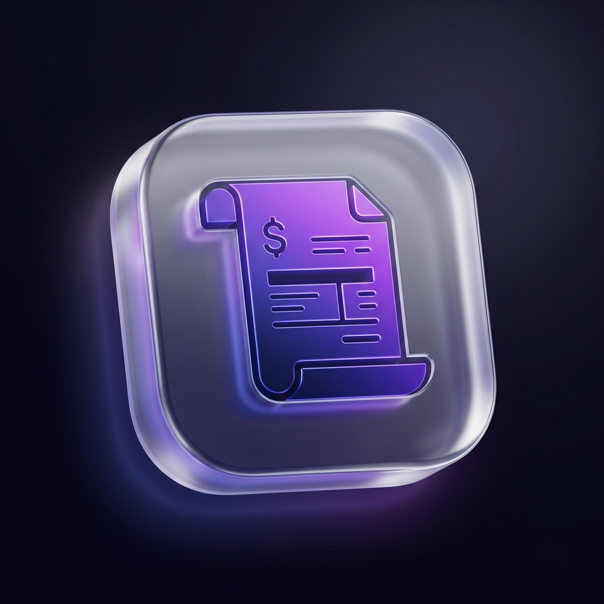

<div align="center">



# Invoice Manager

### A professional, modern invoice management desktop application

Built with **Electron** · **React** · **Shadcn/UI** · **TypeScript**

[](https://www.microsoft.com/windows)
[](https://electronjs.org)
[](https://reactjs.org)
[](https://typescriptlang.org)
[](LICENSE)

</div>

---

## ✨ Features

| Feature | Description |
|---|---|
| 📊 **Live Dashboard** | Real-time revenue stats, charts, and monthly trends |
| 🧾 **Invoice Management** | Full create, edit, delete, and status tracking |
| 👥 **Client Management** | Quick inline client creation and management |
| 📑 **PDF Reports** | Branded PDF invoices, revenue summaries, and client reports |
| 📤 **Excel Export** | Styled `.xlsx` exports with totals and auto-filter |
| 🏢 **Company Branding** | Upload your own logo — appears on all PDF exports |
| 💱 **Multi-Currency** | Choose from 10+ currencies (USD, EUR, GBP, INR, and more) |
| 🔒 **100% Offline** | All data stored locally — no account, no cloud required |
| 🌙 **Dark Mode** | Premium dark UI with glassmorphism design |

---

## 🖥️ Screenshots

> The app ships with a premium dark theme and responsive layout out of the box.

**Dashboard** — Revenue overview, monthly trend chart, top clients, and recent invoices  
**Invoices** — Search, filter, and manage all invoices with one-click actions  
**Reports** — Generate PDF reports with company branding and date range filters  
**Settings** — Configure currency, tax rates, company info, and logo

---

## 🚀 Getting Started

### Prerequisites

Make sure you have the following installed:

- [Node.js](https://nodejs.org/) `v18` or later
- [npm](https://npmjs.com/) `v9` or later

### Installation

```bash
# Clone the repository
git clone https://github.com/YOUR_USERNAME/invoice-manager.git

# Navigate into the project
cd invoice-manager

# Install all dependencies
npm install
```

### Running in Development

```bash
npm run dev
```

This starts the Vite dev server and launches the Electron window simultaneously with Hot Module Replacement (HMR) enabled.

---

## 📦 Building the Installer

To build a production Windows installer (`.exe`):

```bash
npm run dist
```

The output will be in the `dist/` folder. Look for `Invoice Manager Setup 1.0.0.exe`.

To build without packaging (for testing):

```bash
npm run pack
```

---

## 🗂️ Project Structure

```
Desktop-App/
├── build/                    # Electron-builder assets (app icon)
│   └── icon.png
├── resources/                # Default bundled assets
│   └── company_logo.png
├── src/
│   ├── main/                 # Electron main process (Node.js)
│   │   ├── index.ts          # App lifecycle + IPC handlers
│   │   ├── store.ts          # JSON-based local data storage
│   │   └── excel.ts          # Excel export (ExcelJS)
│   ├── preload/              # Secure IPC bridge
│   │   ├── index.ts          # contextBridge API
│   │   └── index.d.ts        # Type declarations
│   ├── shared/               # Shared types (main + renderer)
│   │   └── types.ts
│   └── renderer/             # React frontend
│       ├── index.html
│       └── src/
│           ├── App.tsx           # Root layout + routing
│           ├── index.css         # Global styles + design tokens
│           ├── components/
│           │   ├── Sidebar.tsx   # Collapsible navigation
│           │   └── ui/           # Shadcn/UI components
│           ├── pages/
│           │   ├── Dashboard.tsx
│           │   ├── Invoices.tsx
│           │   ├── InvoiceForm.tsx
│           │   ├── Reports.tsx
│           │   └── Settings.tsx
│           └── lib/
│               └── utils.ts
├── electron.vite.config.ts   # Vite build config
├── electron-builder.yml      # Packaging config
├── tailwind.config.js
└── package.json
```

---

## 🛠️ Tech Stack

| Layer | Technology |
|---|---|
| Desktop Shell | [Electron 33](https://electronjs.org) |
| Build Tool | [electron-vite](https://electron-vite.org) + [Vite](https://vitejs.dev) |
| UI Framework | [React 18](https://reactjs.org) |
| UI Components | [Shadcn/UI](https://ui.shadcn.com) |
| Styling | [Tailwind CSS 3](https://tailwindcss.com) |
| Charts | [Recharts](https://recharts.org) |
| PDF Generation | [jsPDF](https://github.com/parallax/jsPDF) + [jspdf-autotable](https://github.com/simonbengtsson/jsPDF-AutoTable) |
| Excel Export | [ExcelJS](https://github.com/exceljs/exceljs) |
| Icons | [Lucide React](https://lucide.dev) |
| Language | [TypeScript 5](https://typescriptlang.org) |
| Data Storage | Local JSON files via Electron `userData` |

---

## ⚙️ Configuration

All settings are configurable from within the app under the **Settings** page:

- **Company Name, Email, Phone, Address** — appears on PDF headers
- **Company Logo** — upload any PNG/JPG (max 2MB); shown on all PDFs
- **Currency** — choose from USD, EUR, GBP, INR, JPY, AUD, CAD, CHF, CNY, BRL
- **Default Tax Rate** — auto-applied to new invoices
- **Invoice Prefix & Numbering** — e.g. `INV-1001`, `MY-0042`
- **Payment Terms** — default text (e.g. "Net 30")

Data is stored locally at:
```
%APPDATA%\invoice-manager\invoice-manager-data\
```

---

## 📄 Generating PDFs

Navigate to **Reports**, select a date range and status filter, then click **Download PDF** on one of:

- **Invoice Report** — Full invoice list with summary boxes (total, paid, pending)
- **Revenue Summary** — Month-by-month revenue breakdown
- **Client Report** — Revenue, collected, and outstanding per client

All PDFs include your company logo and branding automatically.

---

## 📤 Exporting to Excel

From the **Invoices** page, click **Export Excel**. A native save dialog will appear. The generated `.xlsx` file includes:

- Styled header row (indigo)
- Alternating row colors
- Currency formatting
- Total summary row
- Auto-filter on all columns

---

## 🤝 Contributing

Pull requests are welcome! For major changes, please open an issue first to discuss what you'd like to change.

1. Fork the repo
2. Create your feature branch: `git checkout -b feature/amazing-feature`
3. Commit your changes: `git commit -m 'Add amazing feature'`
4. Push to the branch: `git push origin feature/amazing-feature`
5. Open a Pull Request

---

## 📝 License

This project is licensed under the **MIT License** — see the [LICENSE](LICENSE) file for details.

---

<div align="center">

Made with ❤️ using Electron + React + Shadcn/UI

</div>
